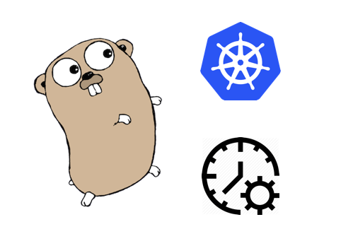
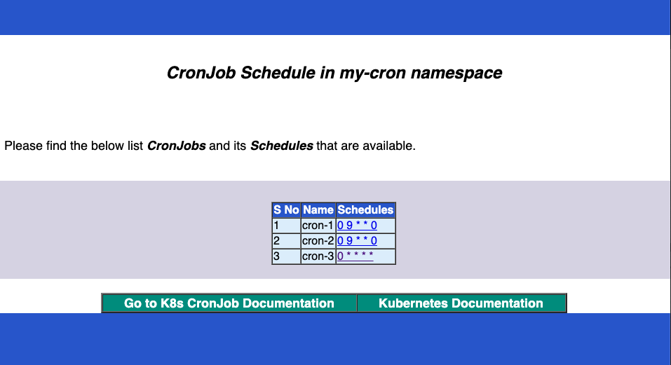

# cronjob-schedule-table
A simple page that lists all the CronJobs that are available in K8s Cluster

Often in Kubernetes cluster developers deploy CronJobs and forgets that. To kepp a track of the deployed CronJobs and its corresponding schedules, they need to run the `kubectl get cronjobs -o custom-columns=JOB:metadata.name,SCHEDULE:spec.schedule` command. This is ok most of the times, but to keep a track of the timetables, it would be great to see these information in the table format.

This small utility program provides the CronJob listing along with the schedules in a HTML page.

By default, the cronjobs are listed within the current namespace. To get the cluster wide list, pass "POD_NAMESPACE" empty string in env variable. Also pass the go-html-template path in "TMPL_FILE_PATH" variable.

Values passed to the html template will construct a page as shown below.

A helm-chart for this is available [here](https://hub.helm.sh/charts/gkarthiks/cron-schedules).